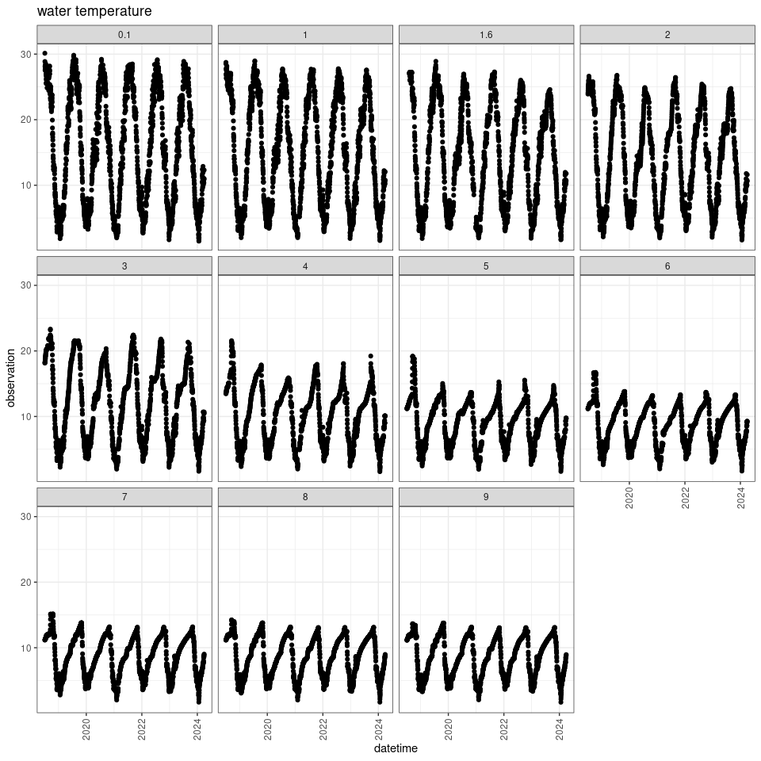
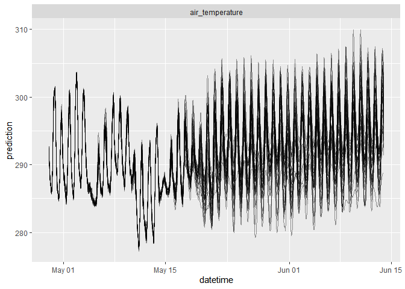
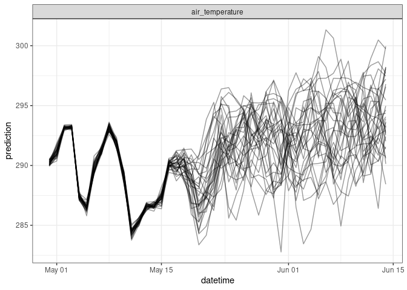
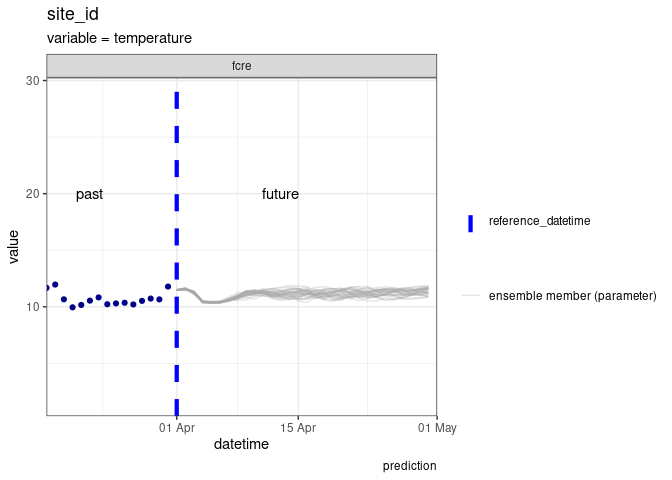
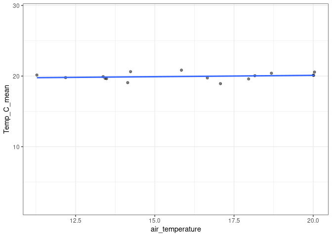

-   [1 This VERA tutorial:](#this-vera-tutorial)
-   [2 Introduction to VERA Forecast
    Challenge](#introduction-to-vera-forecast-challenge)
    -   [2.1 The Challenge](#the-challenge)
    -   [2.2 Submission requirements](#submission-requirements)
        -   [2.2.1 File format](#file-format)
-   [3 The forecasting workflow](#the-forecasting-workflow)
    -   [3.1 Read in the data](#read-in-the-data)
    -   [3.2 Visualise the data](#visualise-the-data)
-   [4 Introducing co-variates](#introducing-co-variates)
    -   [4.1 Download co-variates](#download-co-variates)
        -   [4.1.1 Download historic data](#download-historic-data)
-   [5 Linear model with co-variates](#linear-model-with-co-variates)
    -   [5.1 Convert to forecast standard for
        submission](#convert-to-forecast-standard-for-submission)
-   [6 Submit forecast](#submit-forecast)
-   [7 TASKS](#tasks)
-   [8 Register your participation](#register-your-participation)
-   [9 What’s next?](#whats-next)

# 1 This VERA tutorial:

This document presents a short tutorial to get you started generating
ecological forecasts, specifically for submission to the Virginia
Ecoforecast Reservoir Analysis (VERA) Forecast Challenge. The materials
are modified from those initially developed for the EFI-NEON Forecast
Challenge (found [here](https://zenodo.org/records/8316966)). To learn
more about the VERA Forecast Challenge (see our
[website](https://www.ltreb-reservoirs.org/vera4cast/)).

The development of these materials has been supported by NSF grants
DEB-2327030, DEB-1926388, and DBI-1933016.

To complete the tutorial via this markdown document, the following R
packages will need to be installed first:

-   `remotes`
-   `tidyverse`
-   `lubridate`
-   `RopenMeteo` (from Github)
-   `vera4castHelpers` (from Github)

The following code chunk should be run to install packages.

``` r
install.packages('remotes')
install.packages('tidyverse') # collection of R packages for data manipulation, analysis, and visualisation
install.packages('lubridate') # working with dates and times

remotes::install_github('FLARE-forecast/RopenMeteo') # R interface with API OpenMeteo - weather forecasts
remotes::install_github('LTREB-reservoirs/vera4castHelpers') # package to assist with forecast submission
```

``` r
library(tidyverse)
```

    ## ── Attaching core tidyverse packages ──────────────────────── tidyverse 2.0.0 ──
    ## ✔ dplyr     1.1.4     ✔ readr     2.1.5
    ## ✔ forcats   1.0.0     ✔ stringr   1.5.1
    ## ✔ ggplot2   3.5.0     ✔ tibble    3.2.1
    ## ✔ lubridate 1.9.3     ✔ tidyr     1.3.1
    ## ✔ purrr     1.0.2     
    ## ── Conflicts ────────────────────────────────────────── tidyverse_conflicts() ──
    ## ✖ dplyr::filter() masks stats::filter()
    ## ✖ dplyr::lag()    masks stats::lag()
    ## ℹ Use the conflicted package (<http://conflicted.r-lib.org/>) to force all conflicts to become errors

``` r
library(lubridate)
```

If you do not wish to run the code yourself, you can alternatively
follow along via the markdown document (tutorial.md).

# 2 Introduction to VERA Forecast Challenge

The VERA Forecast Challenge is hosted by the Center for Ecosystem
Forecasting at Virginia Tech [CEF](https://ecoforecast.centers.vt.edu).
We are using forecasts to compare the predictability of different
ecosystem variables, across many different ecosystem conditions, to
identify the fundamental predictability of freshwater ecosystems.

The VERA Forecast Challenge is one component of the Virginia Reservoirs
LTREB project, which is both monitoring and forecasting two reservoirs
with contrasting dissolved oxygen conditions in southwestern Virginia,
USA to broadly advance our understanding of freshwater ecosystem
predictability.

## 2.1 The Challenge

What: Freshwater water quality.

Where: Two Virginia reservoirs (managed by the Western Virginia Water
Authority) and the stream that connects them. To learn more about these
freshwater ecosystems, see
[here](https://www.ltreb-reservoirs.org/reservoirs/).

When: Daily forecasts for at least 30 days-ahead in the future. New
forecast submissions that are continuously updated with observations as
soon as they become available are accepted daily. The only requirement
is that submissions are predictions of the future at the time the
forecast is submitted.

For the VERA Challenge, you can chose to submit to any combination of
sites and variables using any method. Find more information about the
targets available
[here](https://www.ltreb-reservoirs.org/vera4cast/targets.html).

## 2.2 Submission requirements

For the VERA Challenge, submitted forecasts must include *quantified
uncertainty*. The submitted file can represent uncertainty using an
ensemble forecast (multiple realizations of future conditions) or a
distribution forecast (defined by different parameters depending on the
distribution), specified in the family and parameter columns of the
forecast file.

### 2.2.1 File format

The file is a csv format with the following columns:

-   `project_id`: use `vera4cast`.

-   `model_id`: the short name of the model defined as the `model_id` in
    the file name (see below) and in your registration. The `model_id`
    should have no spaces.

-   `datetime`: forecast timestamp. Format `%Y-%m-%d %H:%M:%S`.

-   `reference_datetime`: the start of the forecast (0 times steps into
    the future). There should only be one value of reference_datetime in
    the file. Format is `%Y-%m-%d %H:%M:%S`.

-   `duration`: the time-step of the forecast. Use the value of P1D for
    a daily forecast and PT1H for an hourly forecast.

-   `site_id`: code for site.

-   `depth_m`: the depth (meters) for the forecasted variable.

-   `family`: name of the probability distribution that is described by
    the parameter values in the parameter column. For an ensemble
    forecast, the `family` column uses the word `ensemble` to designate
    that it is a ensemble forecast and the parameter column is the
    ensemble member number (1, 2, 3 …). For a distribution forecast, the
    `family` describes the type of distribution. For a parametric
    forecast with a normal distribution, the `family` column uses the
    word `normal` to designate a normal distribution and the parameter
    column must have values of `mu` and `sigma` for each forecasted
    variable, site_id, depth and time combination.

Parametric forecasts for binary variables should use bernoulli as the
distribution.

The following names and parameterization of the distribution are
supported (family: parameters):

-   lognormal: mu, sigma
-   normal: mu,sigma
-   bernoulli: prob
-   beta: shape1, shape2
-   uniform: min, max
-   gamma: shape, rate
-   logistic: location, scale
-   exponential: rate
-   poisson: lambda

If you are submitting a forecast that is not in the supported list
above, we recommend using the ensemble format and sampling from your
distribution to generate a set of ensemble members that represents your
distribution. The full list of required columns and format can be found
in the [Challenge
documentation](https://www.ltreb-reservoirs.org/vera4cast/instructions.html#forecast-file-format).

-   `parameter` the parameters for the distribution or the number of the
    ensemble members.

-   `variable`: standardized variable name.

-   `prediction`: forecasted value.

# 3 The forecasting workflow

## 3.1 Read in the data

We start forecasting by first looking at the historical data - called
the *targets*. These data are available in near real-time, with the
latency of approximately 24-48 hrs. Here is how you read in the data
from the targets file available:

``` r
#read in the targets data
targets <- read_csv('https://renc.osn.xsede.org/bio230121-bucket01/vera4cast/targets/project_id=vera4cast/duration=P1D/daily-insitu-targets.csv.gz')
```

Information on the VERA sites can be found in the
`vera4cast_field_site_metadata.csv` file on GitHub. This table has
information about the field sites, including location, reservoir depth,
and surface area.

``` r
# read in the sites data
site_list <- read_csv("https://raw.githubusercontent.com/LTREB-reservoirs/vera4cast/main/vera4cast_field_site_metadata.csv",
                      show_col_types = FALSE)
```

Let’s take a look at the targets data!

    ## Rows: 100,823
    ## Columns: 7
    ## $ project_id  <chr> "vera4cast", "vera4cast", "vera4cast", "vera4cast", "vera4…
    ## $ site_id     <chr> "fcre", "fcre", "fcre", "fcre", "fcre", "fcre", "fcre", "f…
    ## $ datetime    <dttm> 2018-07-06, 2018-07-06, 2018-07-06, 2018-07-06, 2018-07-0…
    ## $ duration    <chr> "P1D", "P1D", "P1D", "P1D", "P1D", "P1D", "P1D", "P1D", "P…
    ## $ depth_m     <dbl> 1.6, 1.6, 1.6, 1.6, 1.6, 1.6, 1.6, 1.6, 1.6, 1.6, 1.6, 1.6…
    ## $ variable    <chr> "Temp_C_mean", "SpCond_uScm_mean", "Chla_ugL_mean", "fDOM_…
    ## $ observation <dbl> NA, NA, NA, NA, NA, NA, NA, NA, NA, NA, NA, NA, NA, NA, NA…

The columns of the targets file show the time step (duration, P1D), the
4 character site code (`site_id`), the variable being measured, and the
mean daily observation. We will start by just looking at Falling Creek
Reservoir (`fcre`).

``` r
site_list <- site_list %>%
  filter(site_id == 'fcre')

targets <- targets %>%
  filter(site_id == 'fcre')

targets |> distinct(variable)
```

    ## # A tibble: 33 × 1
    ##    variable             
    ##    <chr>                
    ##  1 Temp_C_mean          
    ##  2 SpCond_uScm_mean     
    ##  3 Chla_ugL_mean        
    ##  4 fDOM_QSU_mean        
    ##  5 Turbidity_FNU_mean   
    ##  6 Bloom_binary_mean    
    ##  7 DO_mgL_mean          
    ##  8 DOsat_percent_mean   
    ##  9 GreenAlgae_ugL_sample
    ## 10 Bluegreens_ugL_sample
    ## # ℹ 23 more rows

There are a number of different physical, chemical, and biological
variables with observations at fcre. We will start by just looking at
P1D Temp_C_mean (mean daily water temperatures).

``` r
targets <- targets %>%
  filter(variable == 'Temp_C_mean',
         duration == 'P1D')
```

## 3.2 Visualise the data

<figure>

<figcaption aria-hidden="true">Figure: Temperature targets data at
FCR</figcaption>
</figure>

We can think about what type of models might be useful to predict water
temperature. Below are descriptions of three simple models to get you
started forecasting:

-   We could use information about current conditions to predict the
    next day. What is happening today is usually a good predictor of
    what will happen tomorrow (persistence model).
-   We could also think about what the historical data tells us about
    reservoir dynamics this time of year. For example, conditions in
    January this year are likely to be similar to January last year
    (climatology/day-of-year model)
-   We could also look at the lake variables’ relationship(s) with other
    variables. For example, we could use existing forecasts about the
    weather to generate forecasts about the reservoir variables.

To start, we will produce forecasts for just one of these depths - the
focal depth at fcre, 1.6 m.

``` r
targets <- targets %>%
  filter(depth_m == 1.6)
```

# 4 Introducing co-variates

One important step to address when thinking about generating forecasts
is to include co-variates in the model. A water temperature forecast,
for example, may be benefit from information about past and future
weather. Data are available from OpenMeteo API, and a simple R package
is available to access them. The function requires you to specify the
location of the site you are interested in, the number of days into the
past and future, and the model you want to use to forecast.

Read more about what variables are available and how to use the R
functions [here](https://github.com/FLARE-forecast/RopenMeteo)

## 4.1 Download co-variates

### 4.1.1 Download historic data

We will generate a water temperature forecast using `air_temperature` as
a co-variate. We can get the location of FCR from the `site_list` table.
The maximum number of past days available from OpenMeteo API is ~90
days. If you need more historical days for model calibration and
testing, historical data are available through OpenMeteo’s [historical
weather API](https://open-meteo.com/en/docs/historical-weather-api). The
past data are a stacked 1 day-ahead pseudo-observation.

The package also includes a function to convert to EFI standard format.

``` r
lat <- site_list |>
  filter(site_id == 'fcre') |>
  select(latitude) |> 
  pull()

long <-  site_list |>
  filter(site_id == 'fcre') |>
  select(longitude) |>  
  pull()

weather_dat <- RopenMeteo::get_ensemble_forecast(
  latitude = lat,
  longitude = long,
  forecast_days = 30, # days into the future
  past_days = 16, # past days that can be used for model fitting (currently up to 16 days)
  model = "gfs_seamless", # this is the NOAA GEFS ensemble model
  variables = c("temperature_2m")) |>
  
  # function to convert to EFI standard
  RopenMeteo::convert_to_efi_standard() |>
  mutate(site_id = 'fcre')
```

This is an ensemble hourly forecast (multiple (31) realisations of
conditions). Now we have a timeseries of historic data and a 31 member
ensemble forecast of future air temperatures.

<figure>

<figcaption aria-hidden="true">Figure: historic and future NOAA air
temeprature forecasts at lake sites</figcaption>
</figure>

To generate a daily water temperature forecast, we will use a daily
water temperature to train and run our model. This is calculated from
the hourly data we have but retains the ensemble members as a source of
driver uncertainty.

``` r
# get daily means
daily_weather <- weather_dat |> 
  mutate(datetime = as_date(datetime)) |>
  group_by(datetime, site_id, variable, parameter) |>
  summarise(prediction = mean(prediction), .groups = 'drop')

ggplot(daily_weather, aes(x=datetime, y=prediction)) +
  geom_line(aes(group = parameter), alpha = 0.4)+
  facet_wrap(~variable, scales = 'free')
```



We will separate the data into `historic_weather` for
training/calibration and then `future_weather` to generate a forecast.
We will also convert to Celsius from Kelvin. For the historical data we
do not need the individual ensemble members, and will train with the
ensemble mean.

``` r
# split it into historic and future
forecast_date <- Sys.Date()

historic_weather <- daily_weather |>
  filter(datetime < forecast_date) |>
  group_by(datetime, variable, site_id) |> 
  # calculate the ensemble mean
  summarise(prediction = mean(prediction), .groups = 'drop') |> 
  pivot_wider(names_from = variable, values_from = prediction) |>
  mutate(air_temperature = air_temperature - 273.15) # convert to degree C


future_weather <- daily_weather |>
  filter(datetime >= forecast_date) |>
  pivot_wider(names_from = variable, values_from = prediction) |>
  mutate(air_temperature = air_temperature - 273.15) # convert to degree C
```

# 5 Linear model with co-variates

We will fit a simple linear model between historical air temperature and
the water temperature targets data. Using this model we can then use our
future forecasts of air temperature (all 31 ensembles from NOAA GEFS) to
estimate water temperature at each site. The ensemble weather forecast
will therefore propagate uncertainty into the water temperature forecast
and give an estimate of driving data uncertainty.

We will start by joining the historic weather data with the targets to
aid in fitting the linear model.

``` r
targets_lm <- targets |> 
  pivot_wider(names_from = 'variable', values_from = 'observation') |> 
  left_join(historic_weather, 
            by = c("datetime","site_id"))

tail(targets_lm)
```

    ## # A tibble: 6 × 7
    ##   project_id site_id datetime            duration depth_m Temp_C_mean
    ##   <chr>      <chr>   <dttm>              <chr>      <dbl>       <dbl>
    ## 1 vera4cast  fcre    2024-05-10 00:00:00 P1D          1.6        20.8
    ## 2 vera4cast  fcre    2024-05-11 00:00:00 P1D          1.6        20.1
    ## 3 vera4cast  fcre    2024-05-12 00:00:00 P1D          1.6        19.8
    ## 4 vera4cast  fcre    2024-05-13 00:00:00 P1D          1.6        19.7
    ## 5 vera4cast  fcre    2024-05-14 00:00:00 P1D          1.6        19.6
    ## 6 vera4cast  fcre    2024-05-15 00:00:00 P1D          1.6        19.1
    ## # ℹ 1 more variable: air_temperature <dbl>

To fit the linear model, we use the base R `lm()` but there are also
methods to fit linear (and non-linear) models in the `fable::` package.
You can explore the
[documentation](https://otexts.com/fpp3/regression.html) for more
information on the `fable::TSLM()` function.

``` r
# Fit linear model based on past data: water temperature = m * air temperature + b
fit <- lm(targets_lm$Temp_C_mean ~ targets_lm$air_temperature)
    
print(fit)
```

    ## 
    ## Call:
    ## lm(formula = targets_lm$Temp_C_mean ~ targets_lm$air_temperature)
    ## 
    ## Coefficients:
    ##                (Intercept)  targets_lm$air_temperature  
    ##                   19.34324                     0.03789

``` r
# Use the fitted linear model to forecast water temperature for each ensemble member
forecasted_temperature <- fit$coefficients[1] + fit$coefficients[2] * future_weather$air_temperature

# Put all the relevant information into a tibble that we can bind together
temp_lm_forecast <- tibble(datetime = future_weather$datetime,
                           site_id = future_weather$site_id,
                           parameter = future_weather$parameter,
                           prediction = forecasted_temperature,
                           variable = "Temp_C_mean")
```

We now have 31 possible forecasts of water temperature at each site and
each day. On this plot each line represents one of the possible
forecasts and the range of forecasted water temperature is a simple
quantification of the uncertainty in our forecast.

Looking at the forecasts we produced:



## 5.1 Convert to forecast standard for submission

A reminder of the columns needed for an ensemble forecast:

-   `datetime`: forecast timestamp for each time step
-   `reference_datetime`: The start of the forecast
-   `site_id`: code for site
-   `family`: describes how the uncertainty is represented
-   `parameter`: integer value for forecast replicate
-   `variable`: standardized variable name
-   `prediction`: forecasted value
-   `model_id`: model name (no spaces) - including `example` will ensure
    we don’t need to register!

The columns `project_id`, `depth_m`, and `duration` are also needed. For
a daily forecast the duration is `P1D`. We produced a water temperature
forecast at the focal depth only (1.6 m).

``` r
# Remember to change the model_id when you make changes to the model structure!
model_id <- 'example_ID'

temp_lm_forecast_standard <- temp_lm_forecast %>%
  mutate(model_id = model_id,
         reference_datetime = forecast_date,
         family = 'ensemble',
         parameter = as.character(parameter),
         duration = 'P1D', 
         depth_m = 1.6,
         project_id = 'vera4cast') %>%
  select(datetime, reference_datetime, site_id, duration, family, parameter, variable, prediction, depth_m, model_id, project_id)
```

# 6 Submit forecast

Files need to be in the correct format for submission. The forecast
organizers have created tools to help aid in the submission process.
These tools can be downloaded from Github using
`remotes::install_github('LTREB-reservoirs/vera4castHelpers')`. These
include functions for submitting, scoring, and reading forecasts:

-   `submit()` - submit the forecast file to the VERA Challenge, where
    it will be scored
-   `forecast_output_validator()` - check the file is in the correct
    format to be submitted

``` r
# Start by writing the forecast to file
save_here <- 'Forecasts/' # just for helpful organisation
forecast_file <- paste0(save_here, forecast_date, '-', model_id, '.csv')

if (dir.exists(save_here)) {
  write_csv(temp_lm_forecast_standard, forecast_file)
} else {
  dir.create(save_here)
  write_csv(temp_lm_forecast_standard, forecast_file)
}
```

``` r
vera4castHelpers::submit(forecast_file = forecast_file)
```

Is the linear model a reasonable relationship between air temperature
and water temperature? Would a non-linear relationship be better? What
about using yesterday’s air and water temperatures to predict tomorrow?
Or including additional parameters? There’s a lot of variability in
water temperatures unexplained by air temperature alone.

    ## `geom_smooth()` using formula = 'y ~ x'



Note: that this is a model built on only a very short period of historic
weather data. Other historic weather data is available from Open Meteo
(see the [ROpen-Meteo
package](www.github.com/FLARE-forecast/RopenMeteo)).

# 7 TASKS

Possible modifications to the simple linear model:

-   Include additional weather co-variates in the linear model. List
    them in the `get_ensemble_forecast()` function.
-   Specify a non-linear relationship.
-   Try forecasting another variable - could you use your water
    temperature to estimate dissolved oxygen concentration at the
    surface? To learn more about the other focal variables, see
    [here](https://www.ltreb-reservoirs.org/vera4cast/targets.html).
-   Include a lag in the predictors.
-   Add another source of uncertainty - what are the errors in the
    linear model?

Until you start submitting ‘real’ forecasts you can (should) keep
`example` in the model_id. These forecasts are processed and scored but
are not retained for longer than 1 month.

# 8 Register your participation

It’s really important that once you start submitting forecasts to the
Challenge that you register your participation. You will not be able to
submit a forecast that is not an example, without first registering the
model_id, with associated metadata. You should register
[here](https://forms.gle/kg2Vkpho9BoMXSy57).

Read more on the VERA Forecast Challenge website
<https://www.ltreb-reservoirs.org/vera4cast/instructions.html>.

# 9 What’s next?

More information and some helpful materials about adding additional
sources of uncertainty and developing your forecasts can be found on the
[VERA
website](https://www.ltreb-reservoirs.org/vera4cast/learn-more.html).

Once you’re happy with your model, you can follow the instructions in
the `forecast_code` directory to start submitting automated forecasts.
